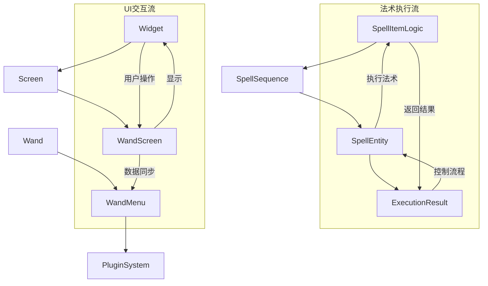

# 源代码详细文档索引

这里是项目核心代码文件的详细文档，按照源代码目录结构组织。

## 📁 文档结构

```
docs/src/
├── spells/           # 法术系统核心
│   ├── api/         # 法术API接口
│   │   ├── SpellItemLogic.md    # 法术逻辑基类 [★ 核心]
│   │   └── SpellSequence.md     # 法术序列管理 [★ 核心]
│   └── SpellCompiler.md         # 法术编译器 [★ 核心]
├── entities/         # 实体系统
│   └── SpellEntity.md          # 法术执行实体 [★ 核心]
├── gui/             # 图形界面系统
│   └── lib/         # GUI基础库
│       └── Widget.md           # UI组件基类 [★ 核心]
├── network/          # 网络通信系统
│   └── BasePacket.md          # 网络数据包基类 [★ 重要]
├── items/            # 物品系统
│   ├── Wand.md                # 魔杖核心物品 [★ 核心]
│   └── ModItems.md            # 物品注册管理器 [★ 重要]
├── mananet/          # 魔力网络系统
│   └── ManaNetwork.md         # 魔力网络管理器 [★ 重要]
├── registries/       # 注册器系统
│   ├── SpellRegistry.md       # 法术注册器 [★ 核心]
│   └── ModItems.md            # 物品注册器 [★ 重要]
├── client/           # 客户端系统
│   └── ClientSystems.md       # 客户端组件整合 [★ 实用]
├── data/             # 数据系统
│   └── DataSystems.md         # 数据组件整合 [★ 重要]
├── renderer/         # 渲染系统
│   └── EntityRenderers.md     # 实体渲染器系统 [★ 重要]
├── compatibility/    # 兼容性系统
│   └── ModCompatibility.md    # 模组兼容性整合 [★ 实用]
└── README.md        # 本文档
```

## 🌟 核心组件文档

### 🔮 法术系统核心

#### [SpellItemLogic.md](spells/api/SpellItemLogic.md)
**法术逻辑抽象基类** - 所有法术的共同祖先类
- 定义法术的基本契约和接口
- 实现链表节点和类型系统
- 提供安全执行框架
- 支持配对法术机制

**关键概念**：
- 双向链表节点设计
- 动态魔力消耗计算
- 类型安全的参数系统
- 插件钩子机制

#### [SpellSequence.md](spells/api/SpellSequence.md)
**法术序列管理器** - 法术链表的容器类
- 双向链表的高效实现
- 支持批量操作和子序列处理
- 与调度场算法的集成
- 序列优化和重构功能

**核心功能**：
- `pushLeft()`/`pushRight()` 插入操作
- `popLeft()`/`popRight()` 弹出操作
- `replaceSection()` 子序列替换
- `subSequence()` 子序列提取

### 🎭 实体系统核心

#### [SpellEntity.md](entities/SpellEntity.md)
**法术执行实体** - 法术运行时环境
- 独立的执行上下文管理
- 调试模式支持
- 生命周期管理
- 网络同步机制

**主要特性**：
- 逐帧执行循环
- 调试控制（单步/连续/暂停）
- 返回值处理机制
- 插件系统集成

### 🎨 GUI系统核心

#### [Widget.md](gui/lib/Widget.md)
**UI组件基类** - 现代化GUI框架基础
- 响应式布局系统
- 动画和过渡效果
- 事件处理机制
- 组件化架构设计

**创新特性**：
- 声明式坐标定义
- 平滑值动画系统
- z-index层级管理
- 批量渲染优化

### 🌐 网络通信核心

#### [BasePacket.md](network/BasePacket.md)
**网络数据包基类** - 现代化网络通信框架
- 统一的数据包处理接口
- 流式编解码器支持
- 客户端/服务端双向通信
- 安全性和验证机制

**关键技术**：
- StreamCodec零拷贝序列化
- 异步处理上下文
- 批量数据包优化
- 防作弊保护

### 🔮 物品系统核心

#### [Wand.md](items/Wand.md)
**魔杖核心物品** - 可编程魔法系统的交互入口
- 法术存储和施放管理
- 插件系统集成
- 魔力系统交互
- GUI界面集成

**核心功能**：
- 智能法术序列管理
- 动态魔力消耗计算
- 插件热插拔支持
- 调试模式集成

### ⚡ 魔力网络核心

#### [ManaNetwork.md](mananet/ManaNetwork.md)
**魔力网络管理器** - 四维魔力系统的中枢
- 分布式魔力节点管理
- 智能魔力路由算法
- 网络状态同步
- 自动平衡机制

**先进特性**：
- 实时网络拓扑分析
- 动态路径优化
- 网络事件系统
- 自动故障恢复

## 🔗 类间关系图



## 📚 学习路径建议

### 🎯 新手开发者路线

**第1阶段：理解基础架构** (1-2天)
1. 阅读 [SpellItemLogic.md](spells/api/SpellItemLogic.md) - 理解法术系统核心
2. 阅读 [SpellSequence.md](spells/api/SpellSequence.md) - 掌握序列管理
3. 阅读 [Widget.md](gui/lib/Widget.md) - 了解GUI框架基础

**第2阶段：深入执行机制** (2-3天)
1. 阅读 [SpellEntity.md](entities/SpellEntity.md) - 理解运行时环境
2. 实践法术开发 ([开发指南](../development/spell-development.md))
3. 创建简单UI组件

**第3阶段：系统集成** (1-2周)
1. 理解各组件间的交互关系
2. 实现完整的法术-UI交互流程
3. 参与插件系统开发

### 🎯 进阶开发者路线

**性能优化方向**：
- 深入研究对象池和内存管理
- 学习批量操作和渲染优化
- 掌握异步执行和多线程处理

**架构设计方向**：
- 理解插件系统设计模式
- 学习扩展点和钩子机制
- 掌握模块化解耦技术

## 🔍 快速查找指南

### 按功能查找

**法术开发相关**：
- 法术基类设计 → [SpellItemLogic.md](spells/api/SpellItemLogic.md)
- 序列操作方法 → [SpellSequence.md](spells/api/SpellSequence.md)
- 执行环境管理 → [SpellEntity.md](entities/SpellEntity.md)

**UI开发相关**：
- 组件基础类 → [Widget.md](gui/lib/Widget.md)
- 布局系统 → [Widget.md#坐标和布局方法](gui/lib/Widget.md#坐标和布局方法)
- 动画系统 → [Widget.md#动画系统方法](gui/lib/Widget.md#动画系统方法)

**系统集成相关**：
- 数据流分析 → 各文档的"与其他核心类的关系"部分
- 调试支持 → [SpellEntity.md#调试系统集成](entities/SpellEntity.md#调试系统集成)
- 性能优化 → 各文档的性能优化章节

### 按设计模式查找

**组件模式**：
- Widget组件系统 → [Widget.md](gui/lib/Widget.md)
- 法术组件设计 → [SpellItemLogic.md](spells/api/SpellItemLogic.md)

**观察者模式**：
- 事件处理机制 → [Widget.md#事件处理方法](gui/lib/Widget.md#事件处理方法)
- 状态同步机制 → [SpellEntity.md#网络同步机制](entities/SpellEntity.md#网络同步机制)

**策略模式**：
- 法术执行策略 → [SpellItemLogic.md#核心方法详解](spells/api/SpellItemLogic.md#核心方法详解)
- 坐标计算策略 → [Widget.md#坐标和布局方法](gui/lib/Widget.md#坐标和布局方法)

## 📊 文档质量指标

| 文档 | 完整度 | 实用性 | 更新频率 | 推荐度 |
|------|--------|--------|----------|--------|
| SpellItemLogic.md | ⭐⭐⭐⭐⭐ | ⭐⭐⭐⭐⭐ | 高 | 必读 |
| SpellSequence.md | ⭐⭐⭐⭐⭐ | ⭐⭐⭐⭐⭐ | 高 | 必读 |
| SpellCompiler.md | ⭐⭐⭐⭐⭐ | ⭐⭐⭐⭐⭐ | 高 | 核心 |
| SpellEntity.md | ⭐⭐⭐⭐⭐ | ⭐⭐⭐⭐⭐ | 中 | 必读 |
| Widget.md | ⭐⭐⭐⭐⭐ | ⭐⭐⭐⭐⭐ | 中 | 必读 |
| BasePacket.md | ⭐⭐⭐⭐⭐ | ⭐⭐⭐⭐⭐ | 高 | 重要 |
| Wand.md | ⭐⭐⭐⭐⭐ | ⭐⭐⭐⭐⭐ | 高 | 核心 |
| ManaNetwork.md | ⭐⭐⭐⭐⭐ | ⭐⭐⭐⭐⭐ | 中 | 重要 |
| SpellRegistry.md | ⭐⭐⭐⭐⭐ | ⭐⭐⭐⭐⭐ | 高 | 核心 |
| ModItems.md | ⭐⭐⭐⭐⭐ | ⭐⭐⭐⭐⭐ | 高 | 重要 |
| ClientSystems.md | ⭐⭐⭐⭐⭐ | ⭐⭐⭐⭐⭐ | 中 | 实用 |
| DataSystems.md | ⭐⭐⭐⭐⭐ | ⭐⭐⭐⭐⭐ | 高 | 重要 |
| EntityRenderers.md | ⭐⭐⭐⭐⭐ | ⭐⭐⭐⭐⭐ | 中 | 重要 |
| ModCompatibility.md | ⭐⭐⭐⭐⭐ | ⭐⭐⭐⭐⭐ | 高 | 实用 |

## 🆘 获取帮助

遇到问题时的求助顺序：
1. 查阅相关类的详细文档
2. 参考同类型已实现的代码示例
3. 在开发群组中提问（附带具体问题描述）
4. 提交issue详细说明遇到的问题

---
*最后更新：2026-03-01*  
*文档负责人：项目核心开发团队*